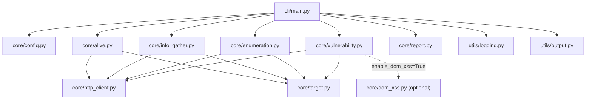

# JuiceChain Architecture (v1.0)

## Module Dependency Graph

## Data Flow

1. CLI args  
`cli/main.py` 解析命令参数，并决定执行 `alive/info/enum/scan/vuln/report/pipeline`。

2. Config merge  
`ScanConfig.from_cli_args()` 先加载 TOML（若提供），再由 CLI 参数覆盖配置值。

3. Scan pipeline  
`scan` 执行 `alive -> info -> enum`，统一写入结构化 `data`。

4. Vulnerability pipeline  
`vuln` 从 `scan` 输出提取输入点，执行 XSS/SQLi 检测；当 `enable_dom_xss=True` 时再懒加载 Playwright 进行浏览器验证。

5. Report pipeline  
`report` 读取 `scan`（可选 `vuln`）并生成 Markdown/HTML。

6. Unified output  
所有命令经 `utils/output.py` 生成统一 schema：`meta / ok / target / data / errors`。

## Key Design Decisions

### 1) Why streamed response reading (`HttpClient` + `max_bytes`)

- 目标站点响应体不可控，必须限制内存占用和处理时间。
- 统一流式读取后，`alive/info/enum/vuln` 都能复用相同网络行为与重试策略。
- 这使工具在 CI 和批量扫描中更稳定，不因超大响应导致 OOM。

### 2) Why SPA fallback noise reduction

- 现代 SPA 常将未知路径统一返回 `index.html`（catch-all）。
- 目录爆破若只看状态码，会把大量虚假路径误报为真实端点。
- JuiceChain 先请求随机不存在路径建立 fallback 签名，再按签名对结果做 `server_endpoint / spa_route / fallback_noise` 分类，显著降低误报。

### 3) Why boolean SQLi needs three-sample confirmation

- 仅比较一次 baseline 与 injection 容易被动态内容干扰。
- 现实现采用三次采样：
  - baseline `r0`
  - injection `r1`
  - confirmation baseline `r2`
- 只有 `r1` 与 `r0/r2` 形成稳定差异时才告警，减少瞬态波动导致的假阳性。

## Runtime Notes

- DOM-XSS 模块为可选依赖，默认不加载浏览器库。
- 日志统一走 `utils/logging.py`，可通过 CLI 控制级别和文件输出。
- 所有命令输出结构固定，便于后续接入自动化平台与报告系统。
